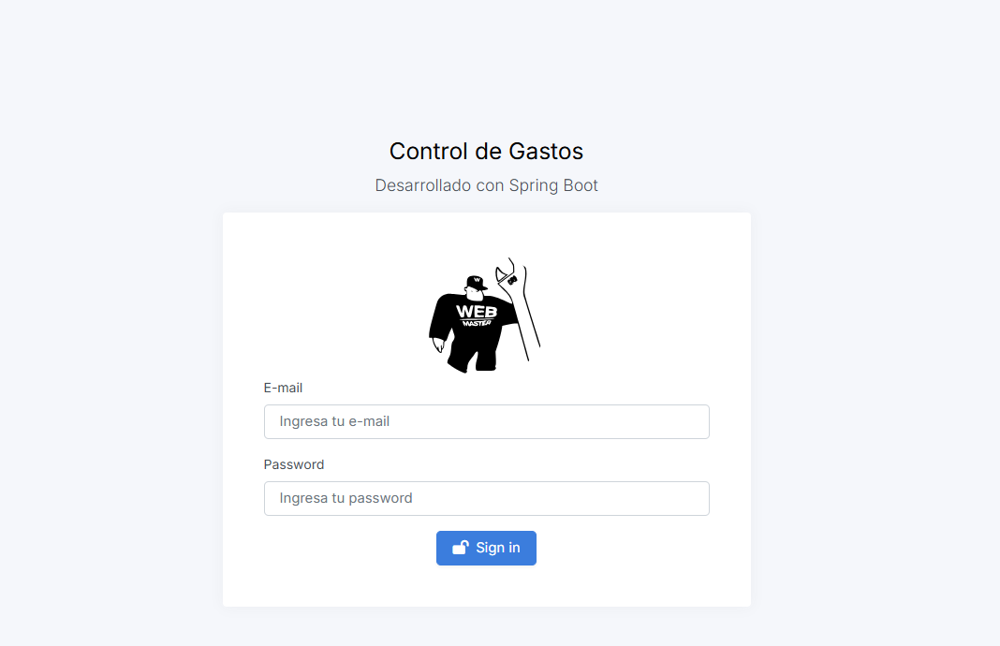
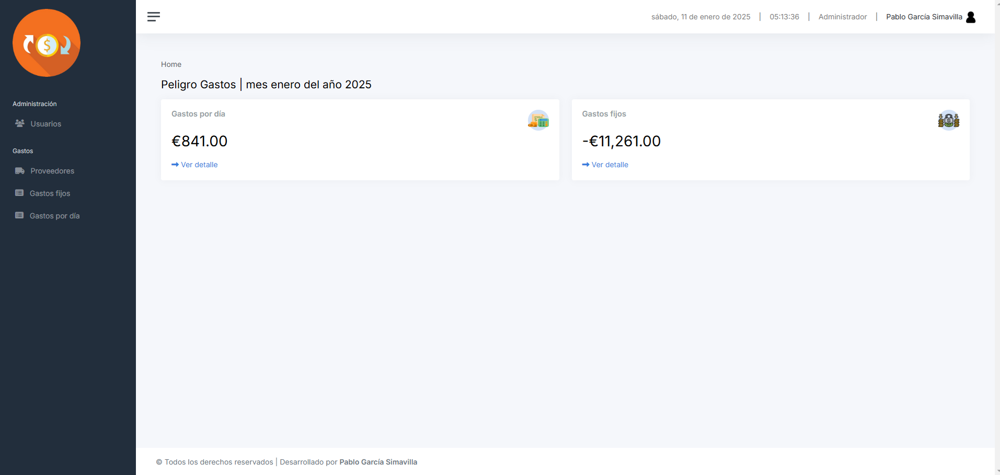
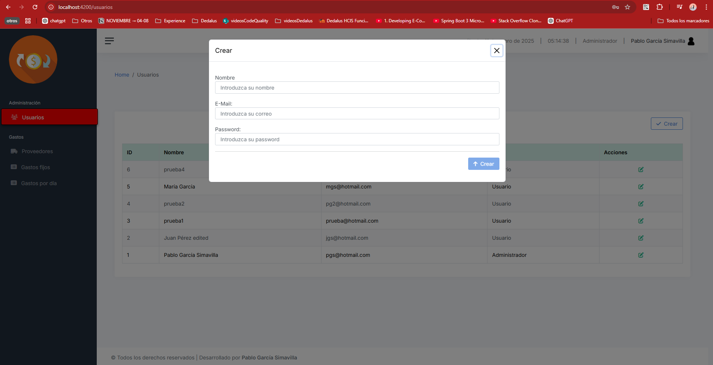
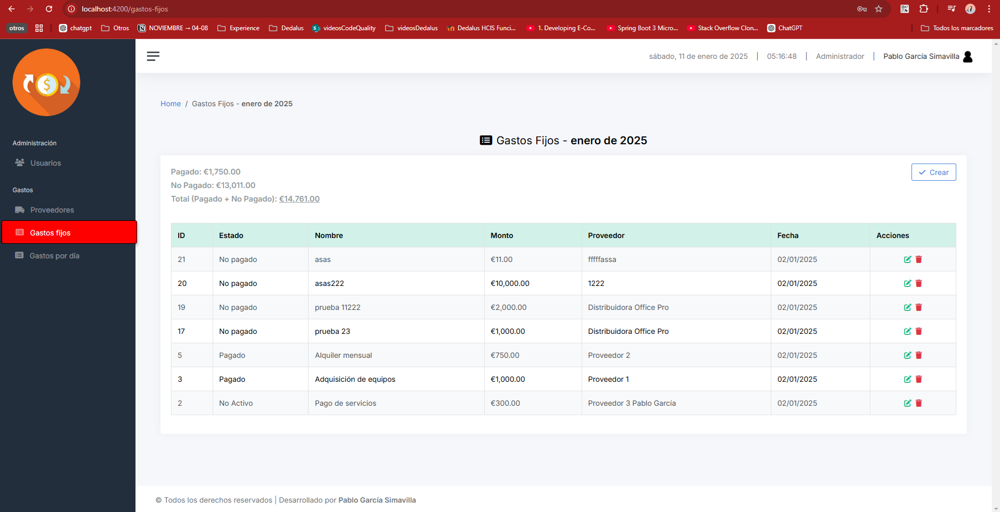
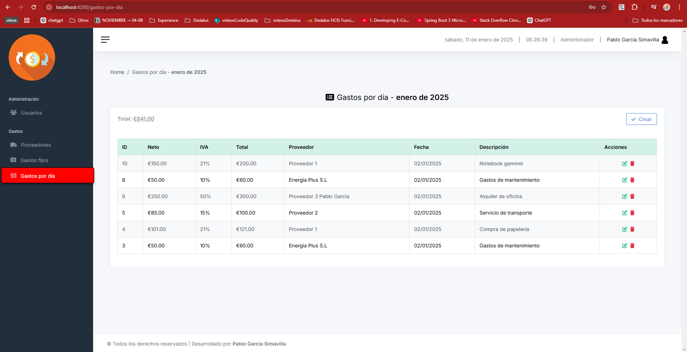
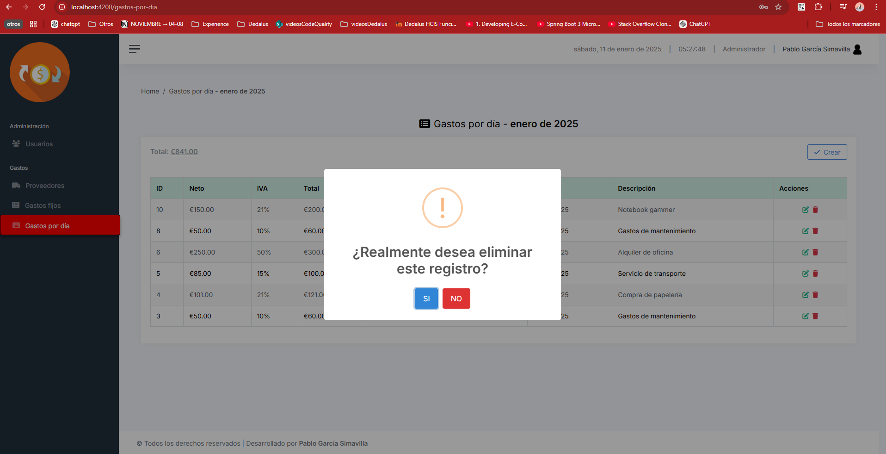
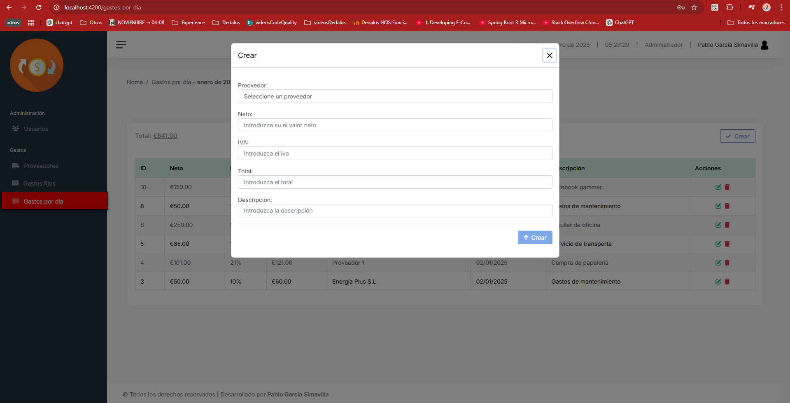
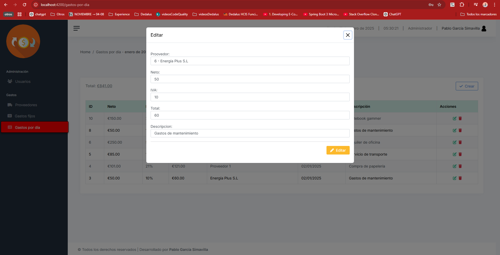
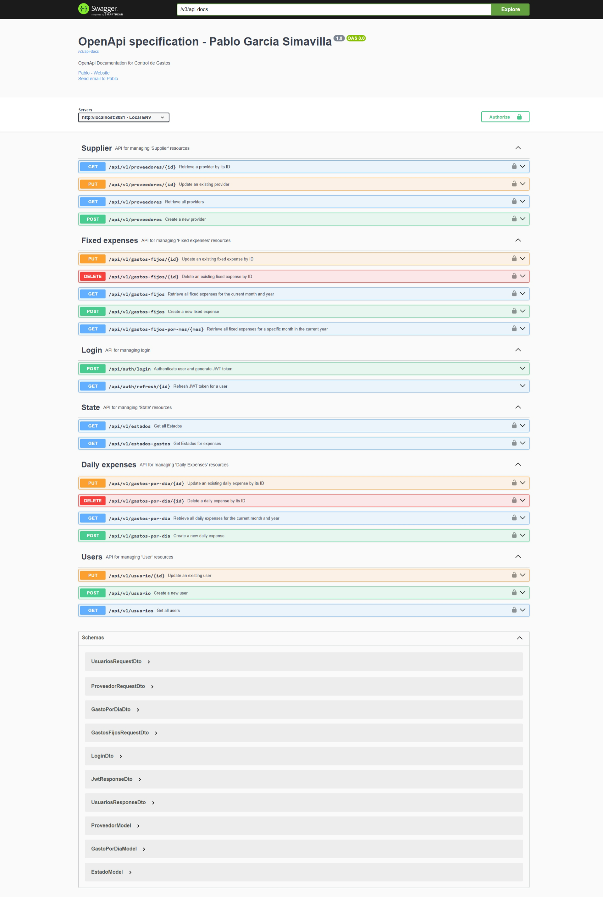

# Angular and Java Spring Boot Expense Management App

This is a full-stack application for managing fixed and daily expenses, built with a Java Spring Boot backend and an Angular 17 frontend. The application allows users to manage their expenses, create providers, and manage user access based on roles (admin). Users can log in, register, and perform CRUD operations on expenses and users.
---

## Frontend Repository

The backend of the application is built with Spring boot and can be found in the following repository:

[Backend Repository - Angular](https://github.com/PagarciaSima/ControlGastos-Backend)

## Features

 **Fixed Expense Management**: Allows users to add, edit, and delete fixed expenses.
- **Daily Expense Tracking**: Records daily expenses with the option for viewing and editing.
- **User Management**: Different user roles (admin and regular user). Admins can manage users.
- **Authentication and Authorization**: JWT authentication in the backend and role-based access control.
- **Provider Creation**: Enables users to create, edit, and delete providers associated with expenses.
- **CRUD Operations**: Perform basic CRUD operations on expenses and users.
- **Secure Backend**: Implemented Spring Security, JWT, and data validation using Spring OpenAPI.
---

## Technologies 

- **Backend**:
  - **Java Spring Boot 3.4.0**: Main framework for building the REST API.
  - **Spring Security**: Authentication and authorization with JWT.
  - **Spring JPA**: Data persistence with relational databases.
  - **OpenAPI**: API documentation and validation.
  - **Lombok**: Simplifies code by generating getters, setters, and other methods automatically.
  - **Mockito & JUnit**: Unit and integration testing.

- **Frontend**:
  - **Angular 17**: JavaScript framework for building interactive user interfaces.
  - **SweetAlert2**: Library for showing custom and attractive alerts.
  - **Day.js**: Date and time manipulation.
  - **Time.js**: Handling times and time-related events.
  - **ngx-cookie-service**: Manages cookies for user authentication.
  - **Standalone Components**: Uses Angular 17’s new architecture for independent components.

---

## Interfaces 

### Login

### Home

### Users

### Fixed expenses

### Daily expenses

### Delete modal

### Create modal

### Edit modal

---

## Swagger UI documentation 

### Documentation

---

## Database and Postman Collection

- The **database** and the **Postman collection** are located in the `Extras` folder of the project.
  - The database can be imported into your local database system for testing.
  - The Postman collection can be used to test the endpoints of the API.

---

## Users

The application has two users with different roles. You can use the following credentials for testing:

1. **Normal User**:
   - **Email**: `jgs@hotmail.com`
   - **Password**: `patata`
   - **Role**: Regular user (limited access to certain features).

2. **Admin User**:
   - **Email**: `pgs@hotmail.com`
   - **Password**: `patata`
   - **Role**: Administrator (full access to all features, including user management).

## Demo
[Link to video Demo](https://www.youtube.com/watch?v=rbbNK8HQ5IY)
